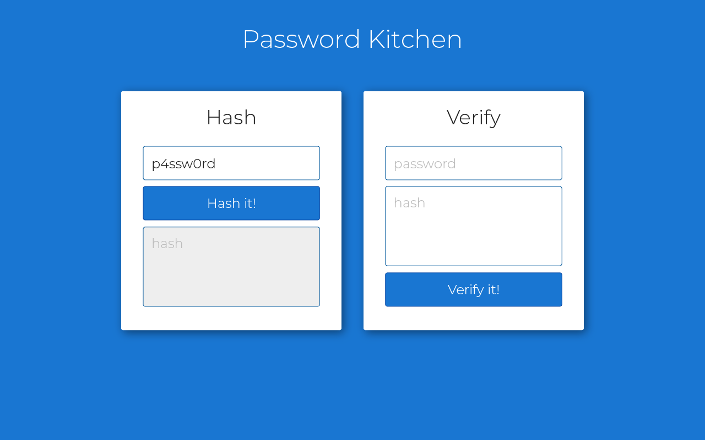
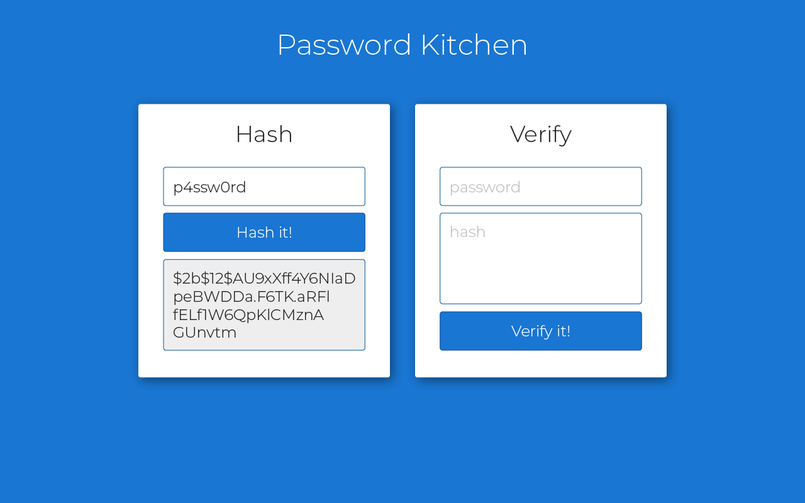
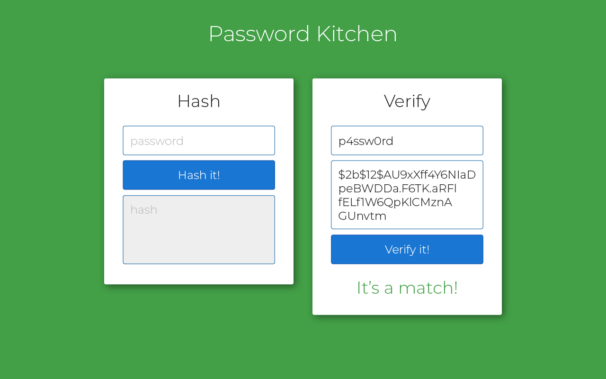
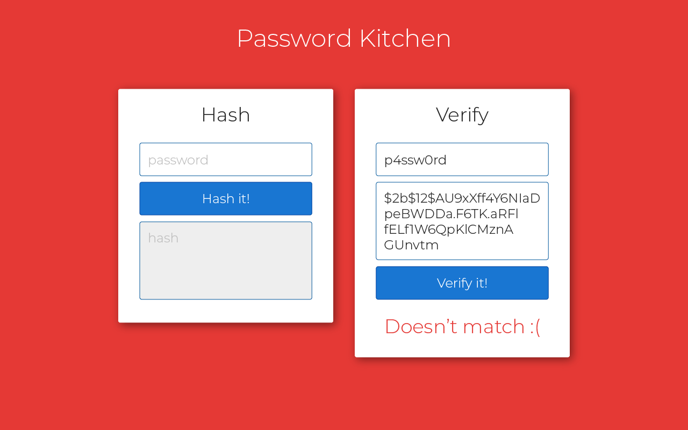

# Password Kitchen

## Intro

This is a small project to hash passwords and verify hashed passwords.

## Design

The designer sent us the following plans:

### Hashing - User input



### Hashing - Result hash



### Verification - User input


### Verification - Match



### Verification - Doesn't match




### Details

Use the following info to achieve the desired result:
- Colors:
  - Background:
    - Default:  #1976d2
    - Verified:  #1976d2
    - Failed verification:  #1976d2
  - Text:
    - Page header:  #fff
    - Card header:  #222
  - Inputs:
    - Background:  #fff
    - Border color:  #01579b
    - Text color:  #222
    - Inactive textarea:  #eee
  - Buttons:
    - Background:  #1976d2
    - Border color:  #01579b
    - Text color:  #fff
- Background:
  - It should cover the whole page
  - When the verification succeeds, the background should change to green.
  - When the verification fails, the background should change to red.
- Cards:
  - They are 400px wide and have 40px gap between them.
  - For the shadow, you can use this snippet: `box-shadow: 0 1px 5px rgba(0, 0, 0, .9)`
  - There is 40px space inside between the edge of the card and the start of the inputs and buttons

## Hashing

The following code snippet provides a short example of how the `bcrypt` library can help hash passwords and verify them:

```python
import bcrypt


def hash_password(plain_text_password):
    # By using bcrypt, the salt is saved into the hash itself
    hashed_bytes = bcrypt.hashpw(plain_text_password.encode('utf-8'), bcrypt.gensalt())
    return hashed_bytes.decode('utf-8')


def verify_password(plain_text_password, hashed_password):
    hashed_bytes_password = hashed_password.encode('utf-8')
    return bcrypt.checkpw(plain_text_password.encode('utf-8'), hashed_bytes_password)


if __name__ == '__main__':
    # Test these functions
    original_password = 'my_very_secureP4ssword!'  # From registration form
    print('original_password: ' + original_password)

    hashed_password = hash_password(original_password)  # This shall be saved in the DB
    print('hashed_password: ' + hashed_password)

    user_input_password = 'Hey Siri, what is my password?'  # From a login form, a mistyped input
    is_matching = verify_password(user_input_password, hashed_password)
    print('is_matching: ' + str(is_matching))

    user_input_password = 'my_very_secureP4ssword!'  # From a login form, the correct input
    is_matching = verify_password(user_input_password, hashed_password)
    print('is_matching: ' + str(is_matching))

```
